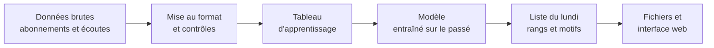

# Chapitre 1. L'application : ce qu'elle fait et pourquoi elle existe

> **Partie 1, découvrir le projet** · Lecture : 20 minutes · Aucun prérequis

## Ce que vous allez apprendre

À la fin de ce chapitre, vous saurez :

- expliquer ce qu'est le churn et pourquoi une entreprise cherche à le prévoir ;
- décrire ce que produit l'application, pour qui, et à quel rythme ;
- dire ce que l'application ne fait pas, et pourquoi ;
- expliquer pourquoi ce projet a été créé et ce qui le distingue d'un projet de churn ordinaire.

---

## 1. Un problème d'entreprise très concret

Imaginez un service par abonnement : de la musique en streaming, un logiciel, une salle de sport. Chaque mois, des abonnés s'en vont. Ce départ porte un nom : le **churn**. On parle aussi d'*attrition* ou de *résiliation*.

Pour l'entreprise, chaque départ est un revenu qui disparaît, souvent pour de bon. Il est généralement plus coûteux de gagner un nouvel abonné que de garder un abonné existant. D'où une idée simple : **repérer les abonnés sur le point de partir, pendant qu'il est encore temps de les retenir**, par exemple par un appel, une offre adaptée ou une aide à l'utilisation.

Mais une équipe n'a pas le temps d'appeler tout le monde. Supposons qu'elle puisse passer 50 appels par semaine. La vraie question devient alors :

> **Chaque lundi, quels 50 abonnés appeler en priorité, et que leur dire ?**

C'est exactement la question à laquelle répond l'application.

## 2. Ce que fait l'application

### Une liste de priorités, chaque semaine

Chaque lundi, l'application :

1. regarde tous les abonnés encore actifs ;
2. estime, pour chacun, le risque qu'il parte dans les 30 jours suivants ;
3. les classe du plus risqué au moins risqué ;
4. livre la liste, avec pour chaque abonné les raisons de son classement.

Voici à quoi ressemble une ligne de cette liste. L'exemple est simplifié, mais les motifs sont ceux que produit réellement l'application :

| Rang | Abonné | Décile de risque | Motif 1 | Motif 2 | Motif 3 |
| ---: | :--- | ---: | :--- | :--- | :--- |
| 1 | Abonné n° 4812 | 1 | [FINANCE] Statut du renouvellement automatique | [FINANCE] Facturation | [PRODUCT] Fréquence d'usage |

Le **rang** dit dans quel ordre appeler. Le **décile** situe l'abonné parmi dix groupes de risque, 1 étant le groupe le plus à risque. Les **motifs** disent de quoi parler au téléphone.

### Pourquoi les motifs comptent autant que le classement

Un classement seul dit **qui** appeler. Il ne dit pas **quoi dire**. Un conseiller qui appelle un abonné sans savoir pourquoi celui-ci est à risque improvise, et l'appel risque d'être inutile.

C'est pourquoi l'application fournit jusqu'à trois motifs par abonné, rédigés dans un langage métier et précédés de leur famille : `[FINANCE]` pour ce qui touche au paiement, `[PRODUCT]` pour ce qui touche à l'utilisation du service. Et quand aucun motif n'est assez net, la case reste vide : **un motif inventé est pire qu'un motif absent**.

### Ce que l'application ne fait pas

Savoir ce qu'un outil ne fait pas évite de mal l'utiliser.

- **Elle ne donne pas de pourcentage.** Elle n'affiche jamais « 87 % de chances de partir ». Le score calculé par le modèle ne se lit pas comme une probabilité fiable, et le besoin réel est un ordre de priorité. Afficher un pourcentage inviterait à un contresens.
- **Elle ne décide rien.** Elle aide à prioriser. C'est l'humain qui appelle, écoute, et choisit quoi proposer.
- **Elle ne fonctionne pas en temps réel.** Elle travaille par lots, une fois par semaine. Pour un horizon de 30 jours, recalculer à chaque seconde n'apporterait rien.
- **Elle ne se branche sur aucun logiciel commercial.** Elle produit des fichiers, ouverts dans un tableur ou dans une interface web. Se connecter à un logiciel de gestion client est volontairement hors du périmètre.

> **À retenir.** L'application produit chaque lundi une liste d'abonnés classés par risque de départ, avec jusqu'à trois motifs lisibles par abonné. Elle aide une équipe à décider qui appeler et quoi dire.

## 3. Comment elle fonctionne, vue d'avion

Le schéma ci-dessous montre le chemin des données, de la source jusqu'à la liste du lundi. Chaque étape fait l'objet d'un chapitre du cours.

- **Données brutes.** L'historique des abonnements, des paiements et de l'utilisation du service. Chapitre 5.
- **Mise au format et contrôles.** Les données sont rangées selon un format commun et vérifiées. Chapitre 4.
- **Tableau d'apprentissage.** Pour chaque abonné et chaque semaine passée, on résume ce qu'on savait de lui, et on note s'il est parti ensuite. Chapitre 6.
- **Modèle.** Un **modèle** est un programme qui a appris, à partir de nombreux exemples passés dont on connaît la fin, à reconnaître les situations qui précèdent un départ. Chapitres 7 et 8.
- **Liste du lundi.** Le modèle classe les abonnés actuels et explique chaque classement. Chapitre 9.
- **Fichiers et interface web.** La liste est livrée dans un fichier et affichée dans une page web. Partie 4, à venir.

Apprendre à partir d'exemples dont on connaît la réponse s'appelle l'**apprentissage supervisé**. C'est comme apprendre à reconnaître les champignons comestibles à partir d'un catalogue où chaque photo porte déjà l'étiquette « comestible » ou « toxique ».

## 4. Les données : un service de musique en streaming

Pour construire et démontrer l'application, il fallait des données réelles. Le projet utilise celles de **KKBox**, un service de musique en streaming par abonnement, publiées pour une compétition sur la plateforme Kaggle en 2017.

Elles contiennent trois choses précieuses :

- l'historique des **transactions** : souscriptions, renouvellements, annulations, montants payés ;
- le journal d'**écoute** quotidien de chaque abonné : nombre de morceaux, temps d'écoute ;
- quelques informations sur chaque **compte**, comme sa date d'inscription.

Le tout couvre la période de janvier 2015 à mars 2017. Le projet travaille sur un échantillon de 8 150 abonnés, tirés au hasard.

> **Attention.** KKBox n'a pas d'équipe qui appelle ses abonnés. La capacité de « 50 appels par semaine » est donc une **hypothèse** qui sert à mesurer la qualité du classement. Le projet l'écrit partout où il cite un résultat.

À côté de ces données réelles, le projet fabrique aussi des **données fictives**, générées par un programme. Elles servent uniquement à tester le code. Aucun résultat obtenu sur ces données fictives n'est présenté comme une performance. Le chapitre 4 explique pourquoi.

## 5. Pourquoi ce projet a été créé

### Deux raisons

**La première est une démonstration de savoir-faire.** Le projet fait partie du portfolio d'un candidat à un poste de Data Scientist. Or un recruteur voit passer des dizaines de projets de churn. Pour qu'un projet se distingue, il doit montrer une **méthode** solide, pas seulement un bon score.

**La seconde est un besoin métier réel.** Le point de départ du projet tient en une phrase : *« Modèle de classification identifiant les clients à risque de résiliation, avec les trois variables les plus prédictives isolées pour l'équipe commerciale. »* Cette demande a été discutée, puis profondément revue, avant la moindre ligne de code. Le chapitre 2 raconte comment.

### Le problème des projets de churn habituels

La plupart des projets de churn publics suivent le même schéma :

1. ils utilisent un tableau qui est une simple **photographie** des clients à un instant donné, sans aucune notion de temps ;
2. ils mélangent les lignes au hasard pour séparer les données d'apprentissage et les données de test ;
3. ils annoncent une **exactitude** élevée, par exemple 95 % de bonnes réponses.

Le résultat paraît excellent, et ne tiendrait pas une semaine dans une vraie entreprise. Pourquoi ? Parce qu'en mélangeant le passé et le futur, le modèle apprend des informations qu'il n'aurait jamais eues au moment de décider. C'est comme réviser un examen avec le corrigé glissé entre les pages. Et parce qu'une exactitude de 95 % ne veut rien dire quand seuls 2 % des clients partent : un modèle qui prédit « personne ne part » a déjà 98 % de bonnes réponses.

### Ce que ce projet fait autrement

| Projet de churn habituel | Ce projet |
| :--- | :--- |
| Une photographie des clients, sans dates | Un historique daté, semaine après semaine |
| Des données mélangées au hasard | Un découpage dans le temps, avec une période tampon entre passé et futur |
| L'exactitude globale | La précision des 50 premiers de chaque semaine, ce que l'équipe vit réellement |
| Aucun point de comparaison | Trois méthodes simples à battre avant de parler de réussite |
| Les variables les plus importantes en général | Trois motifs propres à chaque abonné |
| Une étiquette « parti ou resté » fournie telle quelle | Une étiquette reconstruite depuis les transactions, puis vérifiée contre la référence officielle |

Chacune de ces différences est expliquée dans un chapitre du cours.

## 6. Où en est le projet

La construction est découpée en étapes appelées **lots**. Voici leur état :

| Lot | Contenu | État |
| ---: | :--- | :--- |
| 0 | Socle technique | Terminé |
| 1 | Format commun des données et données fictives | Terminé |
| 2 | Données KKBox et reconstruction de l'étiquette | Terminé |
| 3 | Tableau d'apprentissage sans fuite d'information | Terminé |
| 4 | Protocole d'évaluation et méthodes simples de référence | Terminé |
| 5 | Modèle et explication des prédictions | Terminé |
| 6 | Export des listes | Terminé |
| 7 | Interface web | Terminé, en ligne |
| 8 | Présentation du projet et cours en ligne | Terminé |

Le résultat principal à ce jour, mesuré sur les données KKBox passées : **sur 50 appels par semaine, le modèle désigne en moyenne 14 abonnés qui partiront dans les 30 jours, contre 7 avec la meilleure régression logistique et 4 si l'on appelle simplement les abonnés qui paient le plus.**

---

## À vous de jouer

**Contexte.** Une salle de sport compte 2 000 adhérents. Son équipe d'accueil peut passer 20 appels par semaine. Deux outils lui sont proposés.

- L'**outil A** affiche chaque mois : « 12 % de vos adhérents risquent de partir ce mois-ci. Les facteurs les plus importants sont l'âge et l'ancienneté. »
- L'**outil B** fournit chaque lundi une liste de 20 adhérents classés par risque, avec pour chacun un ou deux motifs, comme « Fréquentation en baisse ».

**Questions.**

1. Lequel des deux outils aide concrètement l'équipe ? Pourquoi ?
2. Un vendeur vante l'outil A en disant qu'il est « exact à 95 % ». Pourquoi ce chiffre ne suffit-il pas à le juger ?
3. L'outil B affiche aussi « 91 % de chances de partir » à côté de chaque nom. Quel problème cela pose-t-il ?

Voir la correction

1. **L'outil B.** L'outil A donne une information globale : l'équipe sait que des adhérents vont partir, mais pas lesquels, ni quoi leur dire. L'âge et l'ancienneté ne sont d'ailleurs pas des leviers d'action : on ne peut pas rajeunir un adhérent. L'outil B répond à la vraie question : qui appeler cette semaine, et de quoi parler.

2. **Parce que les départs sont rares.** Si 12 % des adhérents partent, un outil qui prédirait « personne ne part » serait déjà exact à 88 %. Une exactitude élevée peut donc cacher un outil qui ne détecte aucun départ. Il faut une mesure qui porte sur ce que l'équipe utilise vraiment : la qualité des 20 premiers noms de la liste.

3. **Ce chiffre risque d'être mal compris.** Le score d'un modèle ne se lit pas forcément comme une probabilité fiable. Un conseiller qui lit « 91 % » croira que le départ est presque certain, et risque d'accorder une remise inutile. Pour prioriser, un rang suffit, et il ne trompe personne.

---

## En résumé

- Le **churn** est le départ d'un abonné. Le prévoir permet d'agir avant qu'il ne parte.
- L'application produit **chaque lundi une liste d'abonnés classés par risque**, avec **jusqu'à trois motifs** par abonné.
- Elle **n'affiche pas de pourcentage**, ne décide rien, et fonctionne par lots hebdomadaires.
- Elle est construite et mesurée sur les **données réelles de KKBox**, un service de musique en streaming. Des données fictives servent uniquement aux tests.
- Elle se distingue des projets de churn habituels par sa **rigueur face au temps** : historique daté, découpage temporel, mesure adaptée au métier, comparaison à des méthodes simples.

**Chapitre suivant :** [2. La méthode : construire un projet de data science pas à pas](02-methode.md)
