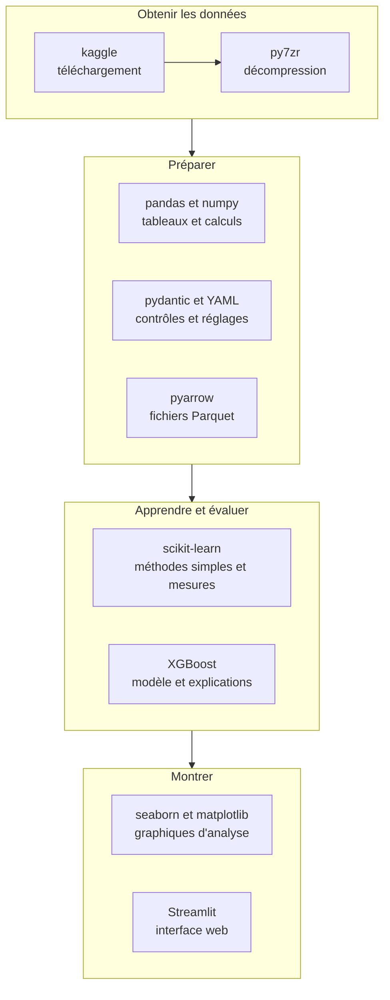

# Chapitre 3. Les outils : les choix technologiques expliqués

> **Partie 1, découvrir le projet** · Lecture : 30 minutes · Prérequis : chapitres 1 et 2

## Ce que vous allez apprendre

À la fin de ce chapitre, vous saurez :

- nommer les principaux outils du projet et dire à quoi sert chacun ;
- expliquer pourquoi chaque outil a été préféré à une alternative ;
- justifier les outils volontairement écartés ;
- appliquer une grille simple pour décider d'adopter ou non un nouvel outil.

---

## 1. Vue d'ensemble

Un projet de data science assemble plusieurs outils, chacun spécialisé. Voici comment ils s'organisent dans ce projet :



Autour de ces briques, des outils de qualité veillent en permanence : **pytest**, **ruff**, **mypy** et **GitHub Actions**, présentés au chapitre 2.

La liste exacte des outils et de leurs versions est dans `docs/stack.md`.

## 2. Le langage : Python

**Python** est le langage le plus utilisé en data science. Ce n'est pas le plus rapide, mais il est lisible, et surtout il dispose d'un écosystème immense de bibliothèques pour manipuler des données et entraîner des modèles.

Une **bibliothèque** est un ensemble de fonctions prêtes à l'emploi, écrites par d'autres. Plutôt que de réécrire un calcul statistique, on utilise celui d'une bibliothèque éprouvée.

Le projet exige au minimum **Python 3.12** et se développe avec la version **3.14**. Les contrôles automatiques tournent sur les deux, pour garantir que le code fonctionne sur l'une comme sur l'autre.

## 3. Installer sans surprise : uv et le fichier de verrouillage

### Le problème du « chez moi, ça marche »

Un projet Python dépend de dizaines de bibliothèques, qui dépendent elles-mêmes d'autres bibliothèques. Ici, 94 au total. Si deux personnes installent des versions différentes, le même code peut donner des résultats différents, ou planter chez l'une et pas chez l'autre.

### La solution

**uv** est un outil qui installe les bibliothèques et crée un environnement isolé pour le projet. Il produit surtout un **fichier de verrouillage**, `uv.lock`, qui note la version exacte de chacune des 94 bibliothèques.

Pensez à une recette de cuisine. `pyproject.toml` dit « de la farine, au moins de type 55 ». `uv.lock` dit « farine de telle marque, tel lot ». Avec le second, tout le monde obtient exactement le même gâteau.

Pour installer tout le projet sur un nouvel ordinateur, une seule commande suffit :

```bash
uv sync
```

## 4. Manipuler les données : pandas et numpy

**pandas** manipule des tableaux de données, qu'on appelle des *DataFrames* : filtrer des lignes, regrouper, joindre deux tables, calculer des moyennes. C'est l'équivalent programmable d'un tableur, capable de traiter des millions de lignes.

**numpy** fait les calculs numériques rapides sur lesquels pandas s'appuie.

**Pourquoi pas polars ?** Polars est une bibliothèque plus récente et plus rapide. Mesure faite sur le calcul clé du projet, elle était 4,5 fois plus rapide, pour un gain de 1,6 seconde. Ce gain ne justifiait pas de faire cohabiter deux outils qui font la même chose, alors que tout le reste de la chaîne parle pandas. C'est la décision D13.

> **Attention.** Un outil populaire n'est pas un outil sans pièges. Le projet a découvert trois comportements de pandas qui produisent des résultats faux **sans le moindre message d'erreur**. Le chapitre 6 les présente, avec les tests qui les surveillent.

## 5. Stocker les données : Parquet plutôt que CSV

Le format **CSV** est un simple fichier texte, lisible par tout le monde. Mais il ne retient pas le type des colonnes : une date y est un texte qu'il faut réinterpréter à chaque lecture. Et il prend beaucoup de place.

Le format **Parquet**, lu et écrit grâce à la bibliothèque **pyarrow**, range les données par colonne, conserve leur type et les compresse.

Chiffre réel du projet : le journal de 4 329 107 événements de l'échantillon KKBox occupe **25,5 Mo** en Parquet. Le fichier d'écoute d'origine, en CSV, pèse 30,5 Go pour l'ensemble des abonnés.

Le projet produira aussi des CSV, mais seulement là où un humain doit ouvrir le fichier dans un tableur, au lot 6.

## 6. Contrôler et régler : pydantic et YAML

### Des réglages hors du code

Tous les paramètres métier du projet sont dans un fichier de configuration, `config/config.yaml`, écrit au format **YAML**, un format texte lisible :

```yaml
business:
  min_account_age_days: 60
  weekly_capacity_k: 50
  top_factors: 3
```

Pourquoi ne pas écrire directement `50` dans le code ? Parce que le jour où l'équipe peut passer 80 appels par semaine, on change une ligne de configuration, sans toucher au code ni risquer d'oublier un endroit.

### Des erreurs détectées au démarrage

**pydantic** vérifie qu'une donnée a la bonne forme. Le projet l'utilise pour le fichier de configuration : une clé manquante ou une valeur incohérente provoque une erreur claire **dès le démarrage**, jamais au milieu d'un calcul de dix minutes. Par exemple, une période tampon plus courte que l'horizon de prédiction est refusée immédiatement.

## 7. Apprendre et évaluer : scikit-learn et XGBoost

**scikit-learn** est la bibliothèque de référence du machine learning en Python. Le projet l'utilise pour la **régression logistique**, une méthode simple qui sert de point de comparaison, et pour certaines mesures de qualité.

**XGBoost** est la bibliothèque du modèle principal. Elle construit des centaines de petits arbres de décision qui se corrigent les uns les autres, une technique très efficace sur des données en tableau. Le chapitre 8 l'explique pas à pas.

**Pourquoi XGBoost ?** Trois bibliothèques de ce type ont été mesurées : XGBoost, LightGBM et un modèle de scikit-learn. Les trois étaient rapides. Le point décisif a été l'**explication des prédictions** : XGBoost calcule lui-même les contributions de chaque variable, exactement comme la bibliothèque spécialisée shap, sans avoir besoin de celle-ci. C'est la décision D12.

La bibliothèque **shap** reste disponible pendant le développement pour explorer, mais elle n'entre pas dans l'application finale.

## 8. Montrer : seaborn, matplotlib et Streamlit

**seaborn** et **matplotlib** dessinent des graphiques. Ils servent à l'**analyse interne** : vérifier la distribution des variables, suivre la précision semaine après semaine. Ils ne servent pas à l'équipe commerciale : une image ne se trie pas et ne se filtre pas. C'est la décision D10.

**Streamlit** permet de construire une interface web entièrement en Python. Elle affichera la liste du lundi, la fiche d'un abonné et les résultats du modèle, au lot 7.

**Pourquoi pas une application React ou Next.js ?** Ces technologies produisent des interfaces plus riches, et elles sont maîtrisées par le propriétaire du projet. Mais pour un projet de data science présenté à des recruteurs, le temps passé sur une interface sophistiquée serait pris sur ce qui fait la différence : la méthode. Streamlit offre en plus un hébergement public gratuit, donc un lien cliquable. Et la porte reste ouverte : l'application exportera aussi ses listes en JSON, un format qu'une interface web dédiée pourrait lire plus tard sans rien changer au reste. C'est la décision D15.

## 9. Obtenir les données : kaggle et py7zr

Les données KKBox se téléchargent depuis la plateforme Kaggle avec son outil en ligne de commande, **kaggle**. Elles sont livrées compressées au format 7z, que Python ne sait pas ouvrir seul : la bibliothèque **py7zr** s'en charge.

> **Attention.** Pour télécharger, Kaggle demande un **jeton d'accès**, une sorte de mot de passe. Un jeton ne se colle jamais dans une conversation, un message ou un fichier du projet. Pendant la mise en place, un jeton a été collé par erreur dans une commande : il a été considéré comme compromis et révoqué. Un secret exposé une fois est un secret à remplacer.

## 10. Ce qui est volontairement absent

Savoir ne pas ajouter un outil est aussi une compétence. Voici ce que le projet a écarté, et pourquoi.

| Écarté | Pourquoi |
| :--- | :--- |
| Base de données, comme PostgreSQL | Les résultats sont des fichiers. Une base ajouterait installation et maintenance sans besoin réel. |
| Serveur web d'API, comme FastAPI | L'application calcule une fois par semaine. Personne n'a besoin d'interroger un serveur à la demande. |
| Orchestrateur de tâches, comme Airflow | Une seule commande lance le calcul. Un orchestrateur servirait à coordonner des dizaines de tâches. |
| Réseaux de neurones, comme PyTorch | Sur des données en tableau, les arbres de décision combinés restent la référence. |
| Modèle de langage pour rédiger les motifs | Un dictionnaire fixe traduit chaque variable en libellé métier. Il donne toujours le même résultat et se teste. |
| polars, LightGBM, shap en production | Écartés après mesure, voir les sections précédentes. |

---

## À vous de jouer

**Contexte.** Un collègue enthousiaste propose trois améliorations pour le projet :

- **A.** Stocker les listes du lundi dans une base de données PostgreSQL.
- **B.** Ajouter une API FastAPI pour qu'on puisse obtenir le score d'un abonné à tout moment.
- **C.** Remplacer le fichier de libellés par un modèle de langage qui rédige des motifs plus naturels.

**Questions.**

1. Pour chaque proposition, donnez un argument contre, tiré de ce chapitre.
2. Dans quelle situation la proposition B deviendrait-elle pertinente ?
3. Proposez trois questions à se poser avant d'adopter n'importe quel nouvel outil.

<details>
<summary>Voir la correction</summary>

1. **A.** Les listes sont produites une fois par semaine et lues dans un fichier ou une interface. Une base de données ajouterait installation, sauvegardes et maintenance sans répondre à un besoin existant.
   **B.** Le calcul est hebdomadaire et l'horizon est de 30 jours : un score recalculé à la seconde n'apporterait aucune information utile, pour un coût de serveur permanent.
   **C.** Un modèle de langage peut formuler différemment le même motif d'une fois sur l'autre, voire inventer une raison. Le dictionnaire fixe donne toujours le même libellé, et un test vérifie qu'aucune variable n'en manque.

2. **Si le besoin change.** Par exemple, si un conseiller devait voir le score à jour d'un abonné pendant un appel entrant, et si les données arrivaient en continu. Le périmètre serait alors différent, et la décision serait révisée par écrit.

3. **Exemples de questions :** l'outil répond-il à un besoin qui est dans le périmètre du projet ? Son apport a-t-il été mesuré sur le vrai cas d'usage ? Que coûte-t-il en installation, en dépendances et en maintenance ? Existe-t-il déjà dans le projet un outil qui fait la même chose ?

</details>

---

## En résumé

- **Python** est le langage du projet, pour son écosystème de data science.
- **uv** installe les bibliothèques et **verrouille leurs versions exactes** dans `uv.lock`, pour que tout le monde obtienne le même résultat.
- **pandas** manipule les tableaux ; **Parquet** les stocke de façon compacte et typée.
- **YAML** porte les réglages métier hors du code ; **pydantic** détecte une configuration incorrecte dès le démarrage.
- **scikit-learn** fournit les méthodes simples de comparaison ; **XGBoost** est le modèle principal et calcule lui-même ses explications.
- **Streamlit** portera l'interface web, choisie pour sa simplicité et son hébergement gratuit.
- Chaque outil ajouté ou écarté l'est **pour une raison écrite**, souvent après une mesure.

**Chapitre précédent :** [2. La méthode](02-methode.md) · **Suite :** [Quiz de la partie 1](quiz-partie-1.md), puis [4. Le contrat de données](04-contrat-de-donnees.md)
